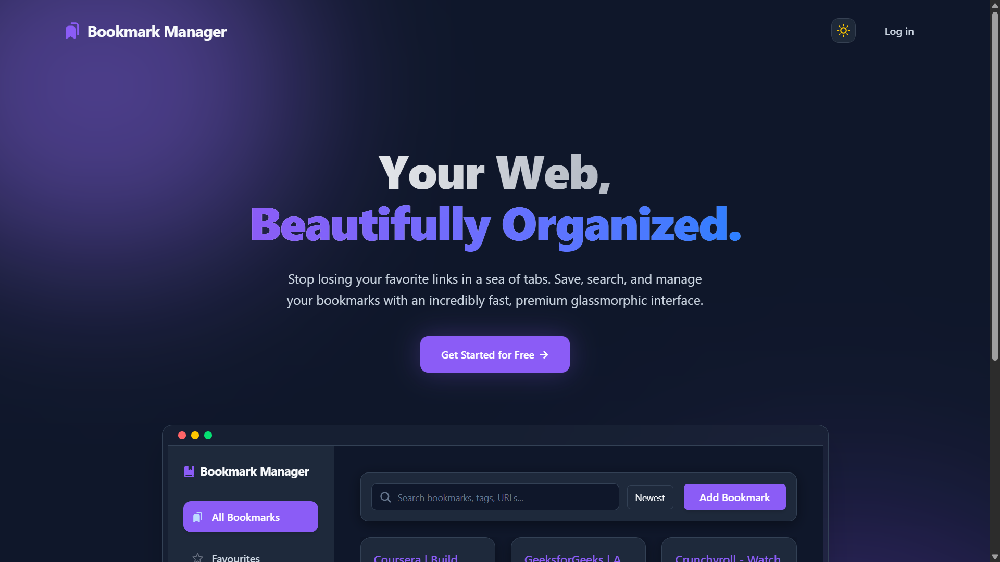
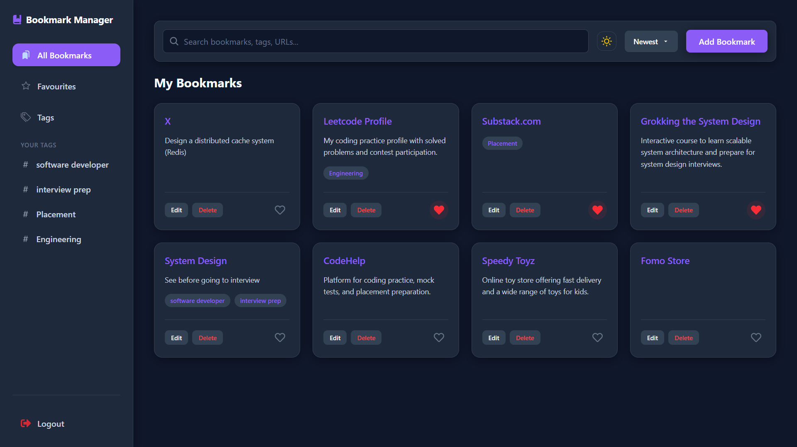

# **Bookmark Manager - Frontend**

[](https://bookmark-manager-frontend-navy.vercel.app/)

**Bookmark Manager Frontend** is a responsive, elegantly designed dashboard for managing web links. This is the UI portion of a complete ecosystem built for seamless bookmarking across devices.

---
## 🚀 Project Overview & Features
**The Problem:** Keeping track of links across different browsers and devices is cumbersome. Built-in bookmark managers often lack syncing without account lock-in, and managing them is tedious.
This frontend solves that by offering a highly customizable dashboard that interacts with a secure Node.js REST API.

**Key Features:**
- **Responsive Dashboard:** Beautiful interface with a fluid layout and **Dark Mode** support.
- **Dynamic Animations:** Engaging interactions powered by Framer Motion and React tsParticles.
- **Complete CRUD Operations:** Create, read, update, and delete bookmarks intuitively.
- **Seamless Integrations:** Connects directly with the bookmark-manager backend.
---
## 🔗 Related Repositories
This project is divided into two separate repositories for modularity. You can explore the other components of the Bookmark Manager ecosystem here:
- 🎨 **[Frontend Repository](https://github.com/satwinder9069/bookmark-manager-frontend)**: The responsive React dashboard.
- ⚙️ **[Backend Repository](https://github.com/satwinder9069/bookmark-manager-backend)**: The Node.js REST API handling authentication and data storage.
---

## 📝 Table of Contents
- [Project Overview & Features](#-project-overview--features)
- [Related Repositories](#-related-repositories)
- [Tech Stack](#-tech-stack)
- [Folder Structure](#-folder-structure)
- [Getting Started](#-getting-started-installation)
- [Screenshots](#-screenshots--gifs)

---

## 🛠 Tech Stack

| Category | Technology | Purpose |
|----------|------------|---------|
| **Core** | React 19 & Vite | High-performance UI library and build tool |
| **Styling** | Tailwind CSS v4 & Tailwind-Motion | Utility-first styling and micro-animations |
| **Routing** | React Router DOM v7 | Seamless single-page application navigation |
| **Animations** | Framer Motion & React tsParticles | Physics-based animations and particle backgrounds |
| **Icons** | React Icons | Comprehenisve SVG icon library |
| **Tools** | ESLint & Vercel | Code linting and production deployment hosting |

---
## 📂 Folder Structure
```text
src/
 ├── assets/           # Static files like logos
 ├── components/       # Reusable UI components & Layouts (ThemeToggle, Toast)
 ├── pages/            # Page-level components (DashboardPage)
 ├── ui/               # Granular UI elements (LandingPage, EmptyState)
 ├── App.jsx           # Main Application routes
 └── index.css         # Global Tailwind CSS configurations
```
---
## 🚦 Getting Started (Installation)
### Prerequisites
- [Node.js](https://nodejs.org/) v18+

### 1. Clone the repo
```bash
git clone https://github.com/satwinder9069/bookmark-manager-frontend.git
cd bookmark-manager-frontend
```
### 2. Install dependencies
```bash
npm install
```
### 3. Environment Variables
Create a `.env` file in the root directory. You will need to provide the base API URL to point to your backend:
```env
VITE_API_BASE_URL=http://localhost:5000/api/v1
```
### 4. Run the app
Start the Vite development server:
```bash
npm run dev
```
---
## 🖼 Screenshots 
- **Landing Page:**
  
- **Dashboard View:**
  
---

*Note: This repository is specifically for the client-side code. The backend API code is located in a separate repository.*